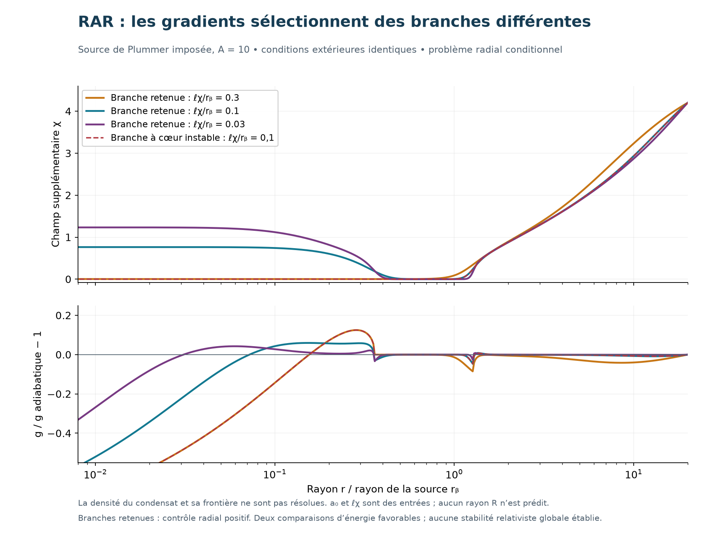

# RAR : premières solutions avec gradients et sélection des branches

6 septembre 2026. Développement numérique après l'audit. Le code `rar_radial_bvp.py` résout un **problème radial conditionnel**, puis teste la courbure de son énergie réduite. La densité du superfluide et sa transition vers la phase normale ne sont pas résolues. Les résultats ne constituent ni un ajustement de galaxies ni une dérivation de RAR depuis l'action 5D.

## 1. Ce qui est effectivement calculé

Dans le secteur gravitationnel inspiré de [Khoury (2016)](https://arxiv.org/abs/1602.05961), nous conservons les gradients du champ χ. Nous prescrivons une masse baryonique de Plummer M_b de rayon r_b, avec éventuellement une masse supplémentaire f M_b de **même profil prescrit**. f n'est ni une fraction de superfluide mesurée ni une population KK calculée.

Les variables sans dimension sont

\[
s=r/r_b,\quad h=g/a_0,\quad
\mathcal A=\frac{GM_b}{a_0r_b^2},\quad
\ell=\frac{\ell_\chi}{r_b},\quad
\ell_\chi=\frac{Z}{\sqrt2 M_4a_0}.
\]

La dernière expression emploie ℏ=c=1. En unités SI, l'accélération doit être convertie de manière cohérente ; dans les produits a0 r, la combinaison sans dimension est a0 r/c². Z est la normalisation du champ χ, pas un rayon compact.

La masse enfermée permet d'intégrer exactement l'équation gravitationnelle sphérique :

\[
\boxed{\frac h{1+\chi^2}+\frac{2\chi^2h^3}{9}=b(s),\qquad
b(s)=\frac{(1+f)\mathcal A s}{(1+s^2)^{3/2}}.}
\]

Le membre de gauche est strictement croissant en h≥0 ; il existe une unique accélération positive pour chaque b>0 et χ fini. Le code résout ce cubic par une expression hyperbolique qui reste régulière quand χ→0.

L'équation restante est

\[
\boxed{\chi''+\frac2s\chi'=\frac{h^2\chi}{\ell^2}
\left[-\frac1{(1+\chi^2)^2}+\frac{h^2}{9}\right].}
\]

Au centre nous imposons χ′(0)=0. Sur la frontière finie S, nous imposons χ(S) égal à la valeur adiabatique locale de la source. **Cette condition extérieure est une hypothèse du problème, pas le résultat d'un raccordement à la phase normale.** L'EFT est supposée applicable à l'intérieur de ce domaine. Aucun condensat n'est présenté comme formé par cette opération.

La comparaison adiabatique utilise h_ad=b pour b≥3 et la racine 0≤h_ad≤3 de

\[
h_{ad}^2-2h_{ad}^3/9=b\quad(0\le b<3).
\]

Ce n'est pas l'interpolation CDD \(g=\sqrt{g_b^2+a_0g_b}\). Les deux partagent une limite de faible accélération mais diffèrent pendant la transition. Le calcul SPARC de l'étape précédente ne constitue donc pas un fit de ces solutions.

## 2. Une branche convergée peut être instable

La première continuation numérique suit une branche depuis une configuration forcée par le bord extérieur. Pour A=10, elle trouve à ell=0,1 et 0,03 un cœur χ≈0. Pourtant, les deux coefficients gravitationnels à χ fixé sont positifs :

\[
\mu_T=\frac1{1+\chi^2}+\frac{2\chi^2h^2}{9}>0,\qquad
\mu_L=\frac1{1+\chi^2}+\frac{2\chi^2h^2}{3}>0.
\]

Ces signes ne contrôlent pas la variation de χ. À masse enfermée b fixée, h varie avec χ. En notant F=h²χ[−(1+χ²)⁻²+h²/9], la perturbation radiale u=sδχ obéit au Jacobien statique

\[
\mathcal H=-\frac{d^2}{ds^2}+\frac1{\ell^2}\frac{dF}{d\chi}\bigg|_b,
\qquad u(0)=u(S)=0.
\]

La dérivée totale inclut la réponse gravitationnelle dh/dχ. `RAR_RADIAL_REFEREE.md` donne la dérivation complète. Un second script, sans NumPy ni SciPy, en contrôle les dérivées et construit des fonctions test indépendantes pour vérifier les signes négatifs.

Une valeur propre négative indique une direction négative de l'énergie statique réduite. Avec une cinétique χ positive supposée canonique et la gravitation traitée comme une contrainte instantanée, elle correspond à une instabilité radiale conditionnelle. **Ce n'est pas un ghost.** Une valeur propre positive dans ce sous-problème ne prouve pas la stabilité du condensat, des perturbations angulaires ou d'une théorie relativiste.

## 3. Deux nouvelles branches à cœur non nul

Une initialisation distincte, proche de la solution adiabatique et régularisée au centre, trouve d'autres solutions avec les mêmes coefficients, la même source et la même condition extérieure. Pour A=10, f=0, S=20 :

| ell | χ au centre, nouvelle branche | Plus petite valeur propre, cœur ≈0 | Plus petite valeur propre, cœur non nul |
|---:|---:|---:|---:|
| 0,1 | 0,764624 | −119,385 | +0,160417 |
| 0,03 | 1,233931 | −2138,083 | +0,740384 |

Les valeurs propres sont exprimées dans les unités du problème radial, donc en r_b⁻² pour l'opérateur dimensionnel. Elles ne sont pas les masses du spectre 5D.

Le contrôle variationnel indépendant donne des quotients de Rayleigh −105,99 et −1756,97 pour les branches à cœur quasi nul. Il confirme leur signe sans utiliser la matrice spectrale du solveur.

La comparaison d'énergie peut aussi être faite exactement dans cette réduction. Après élimination de h à b fixé, poser

\[
W(\chi;b)=-\frac{h^2}{1+\chi^2}-\frac{\chi^2h^4}{3},\qquad
\mathcal E=\int_0^S ds\,s^2[\ell^2\chi'^2+W].
\]

On vérifie W_χ=2F. Les nouvelles branches ont une énergie **plus basse** que les branches à cœur nul sous les mêmes conditions :

| ell | E(cœur non nul) − E(cœur ≈0) |
|---:|---:|
| 0,1 | −0,001612472 |
| 0,03 | −0,003599137 |

La variation de quadrature entre 16 384 et 32 768 intervalles reste au plus de l'ordre de 10⁻¹² pour ces énergies. Cela contrôle l'intégration des solutions obtenues, pas une erreur physique. Cette sélection distingue les branches comparées ; elle ne démontre pas que tous les extrema ont été trouvés ou que le minimum global est connu.

## 4. Étendue des tests et convergence

Le jeu déclaré explore A∈{1 ; 10 ; 100}, ell∈{1 ; 0,3 ; 0,1 ; 0,03}, S=20, f=0. Les deux initialisations donnent 24 tentatives, dont 20 convergent. Les premières tentatives pour A=100 échouent, mais la seconde initialisation trouve les 12 points du jeu. Un échec numérique n'est jamais interprété comme une preuve d'inexistence. Les profils, diagnostics et tentatives sont conservés.

Pour A=10, ell=0,1 et 0,03, la tolérance du problème aux limites est resserrée de 10⁻⁵ à 2×10⁻⁷. Les accélérations changent au plus d'environ 1,4×10⁻⁸ et 5,1×10⁻⁹ relativement, sur la grille enregistrée hors de l'origine. Le maillage du Jacobien est doublé de 2 400 à 4 800 intervalles ; ses valeurs propres minimales restent respectivement 0,1604174 et 0,7403839.

Nous avons également doublé le rayon extérieur de 20 à 40 pour un point, et ajouté f=0,3 puis f=1 avec le profil prescrit. Les diagnostics se trouvent dans `radial_summary.json`. Ils ne constituent ni une marginalisation sur l'environnement, ni une preuve d'indépendance vis-à-vis de toute condition de bord.

## 5. Ce que les gradients changent pour RAR

À source A=10 et ell=0,03, la branche à cœur non nul reste proche de la formule adiabatique sur 0,05≤s≤10 : le plus grand écart relatif observé sur cette grille est environ 4,3 %. À ell=0,1, cet écart est environ 8,0 %. Ces chiffres comparent deux solutions théoriques sous les mêmes hypothèses ; ils ne mesurent pas l'accord à SPARC.

Au centre, une solution régulière possède χ(0) fini. Son accélération est alors proportionnelle à r pour une densité centrale finie, alors que la règle adiabatique profonde donnerait une dépendance en √r. Les gradients créent donc un régime central distinct. Aux transitions également, ils empêchent de remplacer partout χ par son minimum local.

Une nouvelle échelle physique ell_chi intervient. Pour un même Z et un même a0, le rapport ell_chi/r_b change avec la taille de la galaxie. Une RAR universelle ne peut donc être simplement postulée : il faut calculer les écarts en fonction de la taille, du profil, de la masse sombre et de l'environnement, puis vérifier si un ensemble **commun** de coefficients fonctionne. Choisir un Z par galaxie réintroduirait un ajustement que la théorie veut éviter.

## 6. Ce qui reste requis pour un modèle de halo DDF

La prochaine fermeture physique doit déterminer n(r), sa charge totale ou son origine, son interaction et la transition normale/superfluide, puis remplacer la source sombre imposée par sa contribution calculée. Le système gravitationnel et le condensat doivent satisfaire leurs équations ensemble. La source supplémentaire f ne peut pas être réglée indépendamment d'une explication déjà calibrée sur les baryons.

Le raccord 5D est examiné dans `RAR_RACCORD_5D.md`. Il exige de nouveaux opérateurs ; la forme des profils et les contraintes relativistes ne sont pas automatiques. Le calcul radial présent fournit un banc concret pour tester ces opérateurs, avec leurs vrais coefficients, dès qu'ils seront définis.

**Acquis de cette étape :** existence numérique de branches sous conditions déclarées, distinction entre ellipticité et stabilité radiale, sélection énergétique parmi deux branches et contrôle des effets de gradients. **Non acquis :** condensat auto-cohérent, prédiction universelle de RAR, origine de a0 ou sélection d'une valeur de R.
